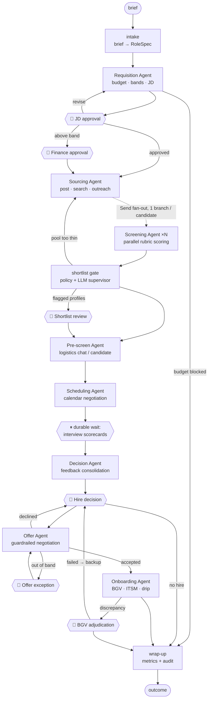

# TalentFlow — Autonomous, Human-Governed Recruitment Lifecycle

TalentFlow is a working multi-agent system that runs the **entire recruitment
lifecycle — position creation to onboarding — autonomously**, while keeping a
human decision-maker in the loop at exactly the checkpoints that matter and
nowhere else. It is built on **LangGraph** (durable orchestration, interrupts,
parallel fan-out, checkpointing) with a **provider-switchable model layer**
powering every specialist agent: **Gemini** (`gemini-2.5-flash`, free tier)
for the testing phase, **Claude** (`claude-opus-4-8`) for production — one
env var flips it, zero code changes.

The thesis it demonstrates: most recruitment cycle time is not interviews or
notice periods — it is **administrative latency between steps** (drafting,
chasing, coordinating, transcribing, ticket-raising). Agents collapse that
latency from days to minutes; the system never removes the judgement calls
that must stay human.

```
Manager brief ──▶ 18-stage orchestration ──▶ Day-1-ready hire
                  8 autonomous agents
                  6 human gates (only when warranted)
                  full audit trail of every action
```

---

## What it automates vs. where humans decide

| Lifecycle stage | Agent (autonomous) | Human gate (interrupt) |
|---|---|---|
| 1. Requisition | Parses the brief, checks HRIS budget, pulls comp bands + market benchmarks, drafts a calibrated JD | **Hiring manager approves the JD** (revision loop); **Finance approves** only if the proposed ceiling exceeds the band |
| 2. Sourcing & screening | Publishes postings, semantically searches the talent pool, sends personalised outreach, **screens every candidate in parallel** against a rubric | Only if the screener flags an *unconventional-but-promising* profile — never silently rejected |
| 3. Pre-screen & scheduling | Chats with candidates to verify notice/comp/location, reads panel calendars, negotiates slots, books the loop conflict-free | — |
| 4. Interviews | Workflow **parks durably** (checkpointed) for however long interviews take | **Panel submits scorecards** (webhook/UI resumes the graph) |
| 5. Decision & offer | Consolidates scorecards into ranked, evidence-based recommendations; negotiates the offer **inside hard comp guardrails** | **Manager makes the hire/no-hire call**; **Recruiter+Finance approve** any out-of-band offer exception |
| 6. Onboarding | Triggers BGV vendor, raises IT laptop/access tickets, schedules a welcome drip across the notice period | **HR/Legal adjudicates** only if BGV returns a discrepancy |

**Outcome paths handled:** hired · candidate declines → manager picks a backup ·
BGV fails → candidate released, backup selection · no budget / no qualified
pool → requisition closed with reasons · JD never converges → closed.

---

## Architecture



`{{🧑 …}}` nodes are LangGraph `interrupt()`s — the workflow checkpoints and
parks (seconds or weeks) until a human decision or external event arrives via
`Command(resume=...)`.

### What it showcases technically

| Capability | Where |
|---|---|
| **Supervisor-governed multi-agent orchestration** | `orchestrator/graph.py` — 18 nodes, dynamic `Command(goto=...)` routing, loop guards |
| **Adaptive (LLM) routing at judgement junctures** | shortlist gate consults an LLM supervisor when the pool is borderline: proceed vs. re-source |
| **Parallel map-reduce over candidates** | screening fans out via `Send`, merges through state reducers |
| **Human-in-the-loop as a first-class primitive** | six `interrupt()` gates with typed request/response contracts (`orchestrator/hitl.py`) |
| **Durable execution / event-driven resumption** | SQLite checkpointer; interviews park the graph until scorecards arrive through the API |
| **Tool-enforced guardrails** | `extend_offer` *refuses* any offer above the approved ceiling — policy lives in code, not in the prompt |
| **Trust-but-verify** | after each agent acts, the node validates the contract against the systems of record and backfills deterministically |
| **Typed agent contracts** | every agent ends with a schema-validated structured output (Pydantic), which is what the graph routes on |
| **Full auditability** | every tool call, agent decision and human approval lands in an append-only event log with actor attribution |

### Layout

```
src/talentflow/
├── domain/models.py        # typed entities: Requisition, Candidate, Offer, AuditEvent, ...
├── integrations/store.py   # mock HRIS, ATS, job boards, calendar, comms, BGV, ITSM (seeded, deterministic)
├── tools.py                # LangChain toolbelts per agent — guardrails enforced inside tools
├── agents/base.py          # specialist runtime: explicit tool loop + structured-output extraction
├── agents/specialists.py   # the 8 agents: requisition, sourcing, screening, pre-screen,
│                           #   scheduling, decision, offer, onboarding (+ intake, supervisor)
├── orchestrator/state.py   # checkpointed workflow state (reducers for parallel writes)
├── orchestrator/hitl.py    # human-gate payload contracts (what an approval inbox renders)
├── orchestrator/graph.py   # the lifecycle graph
├── api/app.py              # FastAPI control plane: start / inspect / resume / timeline
├── simulation.py           # scorecard synthesis for demos & tests
└── demo.py                 # end-to-end CLI demo (interactive or --auto)
```

---

## Run it

```bash
pip install -e ".[dev]"

# Credentials: copy the template and add ONE key (Gemini free tier is enough
# for the whole testing phase — create it at https://aistudio.google.com/apikey)
cp .env.example .env        # then edit: GOOGLE_API_KEY=... or ANTHROPIC_API_KEY=...

# Full lifecycle in one terminal — you play every approver:
talentflow-demo

# Hands-free run with simulated approvers:
talentflow-demo --auto

# Or drive it through the API (durable across restarts):
uvicorn talentflow.api.app:app --reload
# POST /workflows {"brief": "..."}            → runs to the first human gate
# GET  /workflows/{id}                        → current stage + pending action
# POST /workflows/{id}/resume {"approved": true}   → deliver the decision
# GET  /workflows/{id}/timeline               → full audit trail
```

The default demo brief hires a Senior Backend Engineer and deliberately
exercises every gate: a flagged non-traditional candidate, an offer that needs
a comp exception, and a BGV discrepancy needing adjudication.

### Tests (no API key needed)

```bash
pytest
```

The suite drives the **real graph end-to-end offline** — real nodes, real
interrupts, real checkpointing, real mock integrations — with a scripted
schema-aware stand-in for Claude, asserting that exactly the right human gates
fire in lifecycle order and the workflow lands on `hired`.

---

## The business case

For a typical enterprise requisition (industry medians), the human-paced parts
— panel availability, interviews, notice period — are irreducible. Everything
else is queue time that agents remove:

| Internal step | Typical elapsed | With TalentFlow |
|---|---|---|
| Brief → approved, budget-checked JD | 3–7 days | minutes + one approval click |
| Posting, sourcing, first screen of N applicants | 5–10 days | minutes (parallel screening) |
| Logistics pre-screens + loop scheduling | 3–6 days of email ping-pong | minutes |
| Feedback chasing → decision packet | 2–5 days | minutes after last scorecard |
| Offer drafting + tier-1 negotiation | 2–4 days | minutes, guardrailed |
| BGV kickoff, IT tickets, pre-boarding comms | 3–5 days, often dropped | instant, never dropped |

That compresses **18–37 days of administrative latency to roughly the sum of
human decision moments** — typically 30–50 days total cycle down to the
irreducible human core — while *increasing* governance: every action is
audited, every exception is escalated, comp policy is enforced by code, and
flagged candidates are guaranteed a human look instead of an ATS auto-reject.

---

## Product website

A full multi-page product site (business case + deep technical pages) lives in
`website/` — Home, Product, Technology, Solutions & ROI, Security & Governance,
Pricing. Pure static HTML/CSS/JS, no build step:

```bash
python -m http.server -d website 8080   # preview at http://localhost:8080
```

In the GCP deployment below, nginx serves it at `/` with the API at `/api/`.

## Deploy on GCP

The reference deployment is **Docker Compose on your Compute Engine VM** —
nginx serves the website and fronts the API; workflow state persists on a
volume:

```bash
git clone https://github.com/Cosmius-SK/recruiter.git && cd recruiter
cp .env.example .env          # add GOOGLE_API_KEY (ideally from Secret Manager)
docker compose up -d --build
# Website: http://<vm-ip>/      API docs: http://<vm-ip>/api/docs
```

Step-by-step instructions (firewall, Secret Manager, HTTPS, plus a Cloud Run
alternative) are in [`deploy/gcp.md`](deploy/gcp.md).

---

## From demo to production

The seams are already in place:

- **Integrations** — `integrations/store.py` is one adapter layer: swap each
  mock for Workday/SAP (HRIS), Greenhouse/Lever (ATS), LinkedIn/Indeed APIs,
  Google/Microsoft calendars, HireRight (BGV), Jira/ServiceNow (ITSM),
  SendGrid/Twilio (comms). Tool signatures don't change.
- **Approval surface** — the `interrupt()` payloads in `orchestrator/hitl.py`
  are UI-ready contracts; render them in Slack modals, email actions or a web
  inbox, and POST the decision to `/workflows/{id}/resume`.
- **Persistence** — replace SQLite with the Postgres checkpointer for
  multi-instance deployments; workflows already survive process restarts.
- **Scale-out** — the graph is stateless between checkpoints; run it behind a
  queue (one thread per requisition) or on LangGraph Platform.
- **Observability** — the audit log is structured; ship it to your SIEM/BI.
  Add LangSmith tracing with one env var.
- **Compliance** — gates map cleanly to EU AI Act / EEOC expectations:
  human review of automated screening decisions, full decision provenance,
  and code-enforced compensation policy.
